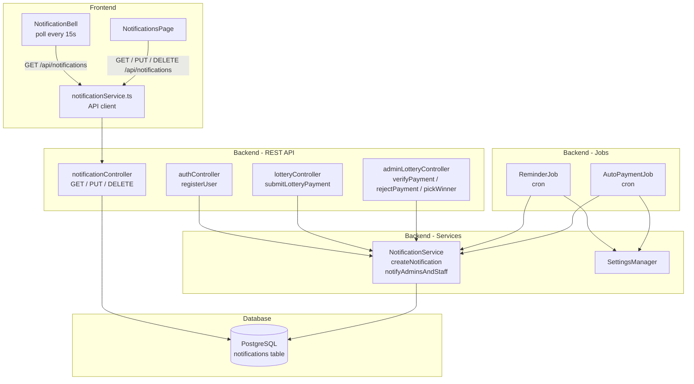

# Design Document: Notification System

## Overview

The Notification System delivers in-app notifications to users of the Gech Car Lottery platform. Notifications are created server-side in response to lifecycle events (registration, payment submission, payment decisions, ticket assignment, lottery draw, reminders, and automated payment processing) and surfaced to the frontend via a REST API. The `NotificationBell` component polls for unread counts every 15 seconds; a dedicated Notifications Page lets users view, mark as read, and soft-delete their notifications.

The design extends the existing `NotificationService`, `notificationController`, `NotificationBell`, and `notifications` table already present in the codebase. The primary work is:

1. Migrating the `notifications` table to the new schema (semantic types, `is_deleted` column, CHECK constraint).
2. Hardening `NotificationService` to validate types and respect the new schema.
3. Updating `notificationController` to filter `is_deleted` and support soft-delete.
4. Wiring notification calls into `authController`, `adminLotteryController`, and `lotteryController` at the correct transactional points.
5. Implementing `ReminderJob` and `AutoPaymentJob` as cron-based background tasks.
6. Building the frontend Notifications Page.

---

## Architecture



---

## Components and Interfaces

### Backend

#### NotificationService (`backend/services/NotificationService.js`)

Responsible for all writes to the `notifications` table.

```js
// Allowed semantic types — enforced at service level and DB CHECK constraint
const ALLOWED_TYPES = [
  'registration', 'payment_pending', 'payment_approved', 'payment_rejected',
  'ticket_assigned', 'lottery_result', 'reminder', 'system_update'
];

createNotification(userId, title, message, type, client?)
// Validates type against ALLOWED_TYPES, rejects and logs if invalid.
// Inserts into notifications table. Accepts optional pg client for transactional use.

notifyAdminsAndStaff(title, message, type, client?)
// Fetches all admin/lottery_staff users, calls createNotification for each.
```

#### notificationController (`backend/controllers/notificationController.js`)

Exposes REST endpoints. All routes are protected by `authMiddleware`.

| Method | Route | Description |
|--------|-------|-------------|
| GET | `/api/notifications` | Returns non-deleted notifications for authenticated user, ordered by `created_at DESC` |
| PUT | `/api/notifications/read-all` | Marks all non-deleted, unread notifications as read for the user |
| PUT | `/api/notifications/:id/read` | Marks a single notification as read (404 if not found, wrong user, or deleted) |
| DELETE | `/api/notifications/:id` | Soft-deletes a notification (`is_deleted = TRUE`) |

#### ReminderJob (`backend/jobs/reminderJob.js`)

Cron job that runs on a configurable schedule (e.g., every hour). On each tick:

1. Reads `Pending_Payment_Threshold` from `SettingsManager`.
2. Queries for payments with `status = 'pending'` created more than threshold ago.
3. For each, checks that no `reminder` notification was created for that user in the last 24 hours.
4. Calls `NotificationService.createNotification` for eligible users.

#### AutoPaymentJob (`backend/jobs/autoPaymentJob.js`)

Cron job whose interval is driven by `Auto_Payment_Interval` from `SettingsManager`. On each tick:

1. Reads `Auto_Payment_Interval` from `SettingsManager`.
2. Queries for payments with `status = 'pending'` older than the interval.
3. Updates their status (e.g., auto-approves or auto-rejects per business rule).
4. Calls `NotificationService.createNotification` for each affected user with type `system_update`.
5. Does not create duplicate notifications for the same payment event.

#### Integration Points

- **authController.registerUser**: After successful user insert, call `NotificationService.createNotification(userId, 'Welcome to Gech Car Lottery', '...', 'registration')`.
- **lotteryController.submitLotteryPayment**: After payment insert, call `createNotification` (user, `payment_pending`) and `notifyAdminsAndStaff` (`payment_pending`) — both within the same transaction client.
- **adminLotteryController.verifyPayment**: Replace current `'success'` type with `'payment_approved'`; add separate `'ticket_assigned'` notification when lottery number is confirmed — both within the same transaction.
- **adminLotteryController.rejectPayment**: Replace current `'error'` type with `'payment_rejected'`.
- **adminLotteryController.pickWinner**: After closing the lottery, query all confirmed participants and call `createNotification` for each with type `'lottery_result'` — within the same transaction.

### Frontend

#### notificationService.ts (`frontend/src/services/notificationService.ts`)

API client wrapping fetch calls to the notification endpoints.

```ts
interface Notification {
  id: string;
  title: string;
  message: string;
  type: NotificationType;
  is_read: boolean;
  created_at: string;
}

type NotificationType =
  | 'registration' | 'payment_pending' | 'payment_approved' | 'payment_rejected'
  | 'ticket_assigned' | 'lottery_result' | 'reminder' | 'system_update';

getNotifications(): Promise<Notification[]>
markAsRead(id: string): Promise<void>
markAllAsRead(): Promise<void>
deleteNotification(id: string): Promise<void>
```

#### NotificationBell (`frontend/src/components/NotificationBell.tsx`)

Polls `getNotifications()` every 15 seconds, counts `!is_read` entries, displays badge. Displays `"9+"` when count > 9. No badge when count is 0.

#### NotificationsPage (`frontend/src/pages/NotificationsPage.tsx`)

Dedicated page at `/notifications`. Displays all non-deleted notifications sorted newest-first. Features:
- Visual distinction between read (muted) and unread (highlighted) notifications.
- Type-based icon/color per `NotificationType` (8 distinct visual treatments).
- "Mark as read" button per notification.
- "Mark all as read" button.
- "Delete" (soft-delete) button per notification.

---

## Data Models

### notifications table (updated schema)

```sql
ALTER TABLE notifications
  ADD COLUMN IF NOT EXISTS is_deleted BOOLEAN DEFAULT FALSE,
  ALTER COLUMN type SET DEFAULT 'system_update';

-- Drop old unconstrained type, add CHECK constraint for semantic types
ALTER TABLE notifications
  DROP CONSTRAINT IF EXISTS notifications_type_check;

ALTER TABLE notifications
  ADD CONSTRAINT notifications_type_check
  CHECK (type IN (
    'registration', 'payment_pending', 'payment_approved', 'payment_rejected',
    'ticket_assigned', 'lottery_result', 'reminder', 'system_update'
  ));

-- Index for efficient unread count queries
CREATE INDEX IF NOT EXISTS idx_notifications_user_unread
  ON notifications(user_id, is_read, is_deleted)
  WHERE is_read = FALSE AND is_deleted = FALSE;
```

Full column set:

| Column | Type | Notes |
|--------|------|-------|
| id | UUID PK | `uuid_generate_v4()` |
| user_id | UUID FK → users(id) | `ON DELETE CASCADE` |
| title | VARCHAR(255) | Not null |
| message | TEXT | Not null |
| type | VARCHAR(50) | CHECK constraint, 8 allowed values |
| is_read | BOOLEAN | Default `FALSE` |
| is_deleted | BOOLEAN | Default `FALSE` — soft delete flag |
| created_at | TIMESTAMPTZ | Default `NOW()` |
| updated_at | TIMESTAMPTZ | Auto-updated by trigger |

### app_settings keys used by jobs

| Key | Type | Description |
|-----|------|-------------|
| `Notifications.pendingPaymentThresholdHours` | number | Hours after which Reminder_Job fires |
| `Notifications.autoPaymentIntervalMinutes` | number | Minutes after which Auto_Payment_Job processes pending payments |

---

## Correctness Properties

*A property is a characteristic or behavior that should hold true across all valid executions of a system — essentially, a formal statement about what the system should do. Properties serve as the bridge between human-readable specifications and machine-verifiable correctness guarantees.*

### Property 1: Registration notification is created for every new user

*For any* valid user registration, after the user is successfully inserted, a notification with `type = 'registration'`, the correct title, and the correct message SHALL exist in the `notifications` table for that user's `user_id`.

**Validates: Requirements 1.1, 1.3**

---

### Property 2: Payment submission creates notifications for user and all admins

*For any* successful payment submission by any user, a `payment_pending` notification SHALL exist for that user AND a `payment_pending` notification SHALL exist for every admin/lottery_staff user in the system.

**Validates: Requirements 2.1, 2.2**

---

### Property 3: Payment decision creates correct notification for payment owner

*For any* payment and any admin decision (approve or reject), the payment owner SHALL receive exactly one notification whose `type` matches the decision (`payment_approved` or `payment_rejected`), and no notification of the opposite type.

**Validates: Requirements 3.1, 3.2**

---

### Property 4: Ticket confirmation creates ticket_assigned notification

*For any* lottery number confirmation for any user, a notification with `type = 'ticket_assigned'` SHALL exist for that user after the confirmation transaction commits.

**Validates: Requirements 4.1, 4.2**

---

### Property 5: Lottery draw notifies all confirmed participants

*For any* lottery with one or more confirmed participants, after the draw completes, every confirmed participant SHALL have a notification with `type = 'lottery_result'`. Users with no confirmed number in that lottery SHALL NOT receive a draw notification.

**Validates: Requirements 5.1, 5.2, 5.3**

---

### Property 6: Reminder job only notifies eligible pending payments

*For any* set of pending payments at varying ages, the Reminder_Job SHALL create a `reminder` notification only for payments whose age exceeds the configured `Pending_Payment_Threshold`, and SHALL NOT create reminders for payments below the threshold or for payments that are no longer in `pending` status.

**Validates: Requirements 6.1, 6.4**

---

### Property 7: Reminder job is idempotent within a 24-hour window

*For any* eligible pending payment, running the Reminder_Job multiple times within a 24-hour window SHALL result in exactly one `reminder` notification for that payment — not multiple.

**Validates: Requirements 6.2**

---

### Property 8: Auto-payment job creates system_update notification for each processed payment

*For any* pending payment processed by the Auto_Payment_Job, exactly one `system_update` notification SHALL be created for the affected user. Running the job again for the same already-processed payment SHALL NOT create a duplicate notification.

**Validates: Requirements 7.1, 7.4**

---

### Property 9: Notification retrieval excludes deleted notifications and is user-scoped

*For any* user with any mix of deleted and non-deleted notifications, the GET notifications endpoint SHALL return only notifications where `is_deleted = FALSE` and `user_id` matches the authenticated user, ordered by `created_at` descending. No other user's notifications SHALL appear in the response.

**Validates: Requirements 8.1, 8.3, 10.3, 14.3**

---

### Property 10: Notification response contains all required fields

*For any* notification returned by the GET endpoint, the response object SHALL contain the fields `id`, `title`, `message`, `type`, `is_read`, and `created_at`.

**Validates: Requirements 8.2**

---

### Property 11: Mark-as-read and mark-all-as-read are correct and user-scoped

*For any* user and any notification belonging to that user, after marking it as read, `is_read` SHALL be `TRUE`. After mark-all-as-read, every non-deleted notification for that user SHALL have `is_read = TRUE`. Attempting to mark a notification belonging to a different user SHALL return a 404.

**Validates: Requirements 9.1, 9.2, 9.3**

---

### Property 12: Soft delete sets is_deleted without removing the row

*For any* notification belonging to the authenticated user, after a delete request, the row SHALL still exist in the `notifications` table with `is_deleted = TRUE`. Attempting to delete a notification belonging to a different user or a non-existent id SHALL return a 404.

**Validates: Requirements 10.1, 10.2, 10.4**

---

### Property 13: Unread count badge displays correct value

*For any* set of notifications for a user, the `NotificationBell` SHALL display a badge equal to the count of notifications where `is_read = FALSE` and `is_deleted = FALSE`. When that count exceeds 9, the badge SHALL display `"9+"`. When the count is 0, no badge SHALL be rendered.

**Validates: Requirements 11.1, 11.2, 11.4**

---

### Property 14: Notification type validation rejects invalid types

*For any* string value not in the allowed set (`registration`, `payment_pending`, `payment_approved`, `payment_rejected`, `ticket_assigned`, `lottery_result`, `reminder`, `system_update`), `NotificationService.createNotification` SHALL reject the call and SHALL NOT write a row to the `notifications` table.

**Validates: Requirements 13.1, 13.2**

---

### Property 15: User deletion cascades to all their notifications

*For any* user with any number of notifications, deleting that user SHALL result in zero notification rows remaining in the `notifications` table for that `user_id`.

**Validates: Requirements 14.2**

---

## Error Handling

| Scenario | Behavior |
|----------|----------|
| Invalid notification type passed to `createNotification` | Log error, return without writing to DB |
| Notification not found or belongs to different user | Return HTTP 404 |
| DB error during notification insert | Log error, do not propagate (notifications are non-critical) |
| Reminder/AutoPayment job DB error | Log error, continue to next payment; do not crash the job |
| Transaction rollback in calling controller | Notification insert is rolled back atomically with the parent transaction |
| `SettingsManager` returns null for threshold/interval | Fall back to safe defaults (e.g., 24h threshold, 60min interval) |

---

## Testing Strategy

### Unit Tests (Vitest — frontend; Jest or Node test runner — backend)

- `NotificationService.createNotification` with valid and invalid types.
- `notificationController` handlers with mocked pool: correct SQL filters, 404 paths, soft-delete behavior.
- `ReminderJob` logic: threshold filtering, duplicate-prevention query.
- `AutoPaymentJob` logic: interval reading from SettingsManager, duplicate-prevention.
- `NotificationBell` rendering: badge display for counts 0, 1, 9, 10, 99.
- `NotificationsPage` rendering: type icons, read/unread visual distinction, control presence.

### Property-Based Tests (fast-check — both frontend and backend)

Use **fast-check** for property-based testing. Each property test runs a minimum of **100 iterations**.

Tag format: `// Feature: notification-system, Property N: <property_text>`

- **Property 1**: Generate random user IDs, call `createNotification` with `type='registration'`, verify row exists with correct fields.
- **Property 2**: Generate random user + random admin sets, call payment submission logic, verify all expected notifications exist.
- **Property 3**: Generate random payment/user pairs, call approve and reject paths, verify correct type on each.
- **Property 4**: Generate random user/lottery-number pairs, confirm number, verify `ticket_assigned` notification.
- **Property 5**: Generate random confirmed participant sets (including empty set), run draw, verify each participant notified and empty set produces zero notifications.
- **Property 6**: Generate random pending payments with ages above and below threshold, run Reminder_Job, verify only eligible ones get reminders.
- **Property 7**: Generate eligible payment, run Reminder_Job twice, verify exactly one reminder notification.
- **Property 8**: Generate random pending payments, run AutoPaymentJob twice, verify exactly one `system_update` per payment.
- **Property 9**: Generate random multi-user notification sets with mixed `is_deleted` values, call GET endpoint as each user, verify isolation and filtering.
- **Property 10**: Generate random notifications, verify response shape contains all required fields.
- **Property 11**: Generate random notification sets, test mark-as-read and mark-all-as-read, verify `is_read` state and 404 on wrong-user attempts.
- **Property 12**: Generate random notifications, soft-delete them, verify row persists with `is_deleted=TRUE` and 404 on wrong-user.
- **Property 13**: Generate random counts (0–100), verify badge display logic (`"9+"` for >9, exact for ≤9, no badge for 0).
- **Property 14**: Generate arbitrary strings not in the allowed type set, verify `createNotification` rejects without DB write.
- **Property 15**: Generate random users with notifications, delete user, verify cascade removes all notifications.

### Integration Tests

- Verify `SettingsManager` threshold/interval values are read correctly by both jobs.
- Verify `notifyAdminsAndStaff` correctly fans out to all admin/lottery_staff users in a real DB.
- End-to-end: register user → notification appears in GET response.

### Smoke Tests

- DB schema has CHECK constraint on `notifications.type`.
- DB schema has `ON DELETE CASCADE` on `notifications.user_id`.
- `NotificationBell` polling interval is set to 15000ms.
- RLS policies are enabled on the `notifications` table (if implemented).
